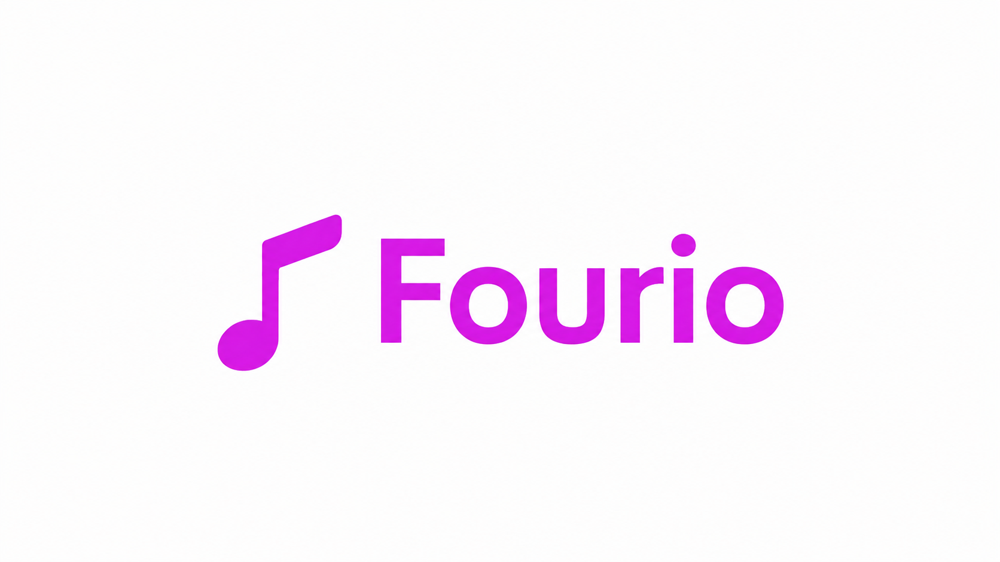
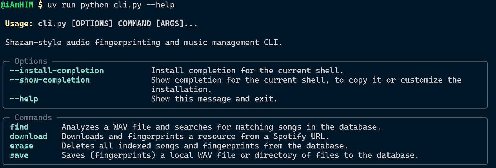

<!-- <h1 align="center">Fourio 🎵</h1> -->

<p align="center">
  <!-- <a href="https://drive.google.com/file/d/1t2RdF4a-nRbqmLAzZ4dTgXcXU4G1T3RZ/view?usp=drive_link" target="_blank"> -->
    
  </a>
</p>


<!-- <p align="center">
  <a href="YOUR_VIDEO_LINK_HERE" target="_blank">
    ▶ Watch Demo Video
  </a>
</p> -->


## Description

**Fourio** is a command-line implementation of a music recognition system inspired by **Shazam**.The name Fourio is a portmanteau of **"Fourier"** and **"Audio"** named after the [**Fourier Transform**](https://en.wikipedia.org/wiki/Fourier_transform).It analyzes song fingerprints, detects matches from local or downloaded tracks, and integrates with Spotify and YouTube for metadata and previews. It has addtional features like a REST APIs, Multiple DB support like MongoDB and SQLite.

This version of **Fourio** is fully written in **Python**, powered by:
- ⚡ **FastAPI** — backend API framework for high-performance web services  
- 🧠 **Typer** — command-line interface (CLI) for intuitive developer experience  
- 🧩 **uv** — ultra-fast dependency manager and environment tool  
- 🎵 **ffmpeg** — audio conversion and processing utility  
- ☁️ **Spotify API** — metadata integration for tracks, albums, and playlists
- 🎞️ **YouTube API** — for fetching song previews and additional metadata

## Project Struture
  ```bash
  fourio/
  ├── app/
  │   ├── api/             # Web API endpoints
  │   ├── utils/           # Logging, file handling, general utilities
  │   ├── db/              # Database connection and operations
  │   ├── models/          # Data models
  │   ├── services/        # Different services like Spotify, YouTube and WAV conversion
  │   ├── core/            # Core fingerprinting, Spectrogram and matching logic
  │   └── main.py          # FastAPI entry point
  |── .env                 # Environment variables
  ├── pyproject.toml       # uv dependencies
  ├── requirements.txt     # Python dependencies  (Optional)
  ├── cli_logic.py         # CLI logic        
  ├── cli.py               # Typer CLI entry point
  ├── .gitignore
  ├── README.md
  └── LICENSE
  ```
---

## Installation

### ✔ Prerequisites

#### 🔹 Python 3.10+  
- [Download Python](https://www.python.org/downloads/)


#### 🔹 FFmpeg (required for audio decoding)  

  **Install FFmpeg:**

  - **Windows (Chocolatey — Recommended)**  
    ```bash
    choco install ffmpeg
    ```

      [Chocolatey install guide](https://chocolatey.org/install)

  - **macOS (Homebrew)**
    ```bash
      brew install ffmpeg
    ```
  - **Linux (Ubuntu/Debian)**
    ```bash
      sudo apt update
      sudo apt install ffmpeg
    ```


  - [**Official FFmpeg download page**](https://ffmpeg.org/download.html)

  **Verify installation:**
  ```bash
    ffmpeg -version
  ```

🔹 uv — ultra-fast Python environment & dependency manager

Install guide:
https://github.com/astral-sh/uv

---
### 🚀 Steps


#### **1. Clone the repository and create a virtual environment using uv**

```bash
# Clone the repo
git clone https://github.com/RudraNarayan94/Fourio.git
cd fourio

# Create virtual environment (using uv)
uv venv

# Install dependencies
uv sync
```

#### **2. (Optional) Setup using Python venv + requirements.txt**
```bash
  # Clone the repo
git clone https://github.com/RudraNarayan94/Fourio.git
cd fourio

# Create virtual environment (using venv)
python -m venv venv

# Activate it
source venv/bin/activate     # macOS/Linux
# On Windows:
# venv\Scripts\activate

# Install dependencies
pip install -r requirements.txt
```

---


### 🎵 Environment Setup

Create a `.env` file inside folder.

Use the structure defined in the sample file:  
👉 **See `.env.example`** ([link](https://github.com/RudraNarayan94/Fourio/blob/main/.env.example))

The `.env` file should include keys for:
- Spotify API access  
- Database configuration  
- Backend settings  
- YouTube API key (optional)

You can generate **Spotify credentials** by creating an app at the  
👉 Spotify Developer Dashboard:  
https://developer.spotify.com/dashboard/

Once created, copy your:
```bash
SPOTIFY_CLIENT_ID=your-client-id
SPOTIFY_CLIENT_SECRET=your-client-secret
```

These credentials allow Fourio to access track metadata, album details, and playlist information.

---


## 🧠 Usage
Run CLI
```bash
uv run python cli.py --help
```

## 🎧 Commands
| Command                           | Description                                               |
| --------------------------------- | --------------------------------------------------------- |
| `find <path_to_audio_file>`       | Analyze audio file in any format and find matching fingerprints         |
| `download <spotify_url>`          | Download and process a song/album/playlist from Spotify   |
| `save <path_or_dir> [--force/-f]` | Fingerprint and save local songs                          |
| `erase`                           | Clear all stored songs and fingerprints from the database |
<!-- | `serve --proto http --port 8000`  | Start the FastAPI backend server                          | -->
# 🔌REST api Endpoints

| Endpoint | Method | Description |
|----------|--------|-------------|
| `/fourio/match` | POST | Match audio fingerprint against database and return top 10 matches |
| `/recordings/save` | POST | Save base64-encoded audio recording as WAV file |
| `/songs/total` | GET | Get total number of indexed songs in database |
| `/songs/download` | POST | Download and process Spotify track/album/playlist |

### 💡 Examples
#### 📌Run Server
```bash
uv run python -m uvicorn app.main:app --reload
```
#### ▶ Download a Spotify track
```bash
uv run python cli.py download https://open.spotify.com/track/4pqwGuGu34g8KtfN8LDGZm
```

#### 🔎 Find a song match
```bash
uv run python cli.py find songs/Voila.mp3
```

#### 💾 Save local songs
```bash
uv run python cli.py save ./local_songs/ --force
```

#### 🧹 Erase all data
```bash
uv run python cli.py erase
```

<!-- #### 🚀 Serve backend
```bash
uv run python cli.py serve --proto http --port 8000
``` -->


## 📚 Resources 
- [SeekTune - Go implementation of Shazam](https://github.com/cgzirim/seek-tune.git)(main resource)
- [How does Shazam work - Coding Geek](https://drive.google.com/file/d/1ahyCTXBAZiuni6RTzHzLoOwwfTRFaU-C/view) (main resource)
- [Song recognition using audio fingerprinting](https://hajim.rochester.edu/ece/sites/zduan/teaching/ece472/projects/2019/AudioFingerprinting.pdf)
- [How does Shazam work - Toptal](https://www.toptal.com/algorithms/shazam-it-music-processing-fingerprinting-and-recognition)
- [Creating Shazam in Java](https://www.royvanrijn.com/blog/2010/06/creating-shazam-in-java/) 

---

## 🧑‍💻 Author

### Rudra Narayan Sahoo
 - Connect with me on [LinkedIn](https://www.linkedin.com/in/rudra404/).
 - Check out my other [GitHub](https://github.com/RudraNarayan94) projects.


## 🚀 Future Roadmap

Fourio have the potential to gradually evolve into a full-stack, Shazam-style system with a modern UI and scalable backend. Feel free to contribute or suggest features!

### 🎧 Frontend (React)
- Modern UI for song matching & downloads  
- Microphone recording & PCM extraction  
- Client-side fingerprint generation  
- WebSocket for real-time matching  
<!-- - Simple waveform visualization   -->

### ⚙️ Backend (FastAPI)
- WEBSOCKETS Endpoints for song processing & matching 
- Redis for backend service 
<!-- - `/songs` → list stored entries   --> 
<!-- - Faster async matching & caching   -->


### 🧠 Fingerprinting Engine
<!-- - Cleaner service-layer architecture   -->
- Better DB Schema for fingerprints 
- Tunable fingerprint density & thresholds  

### ☁️ Deployment
- Docker setup  
- Optional FFmpeg/GPU acceleration  
<!-- - Remote MongoDB sync   -->

<!-- ### 🧩 Long-Term Ideas
- Browser “Music Finder” mode  
- User library for recordings   -->


---
## 📜 License

This project is licensed under the [**MIT License**](https://github.com/RudraNarayan94/Fourio/blob/main/LICENCE).